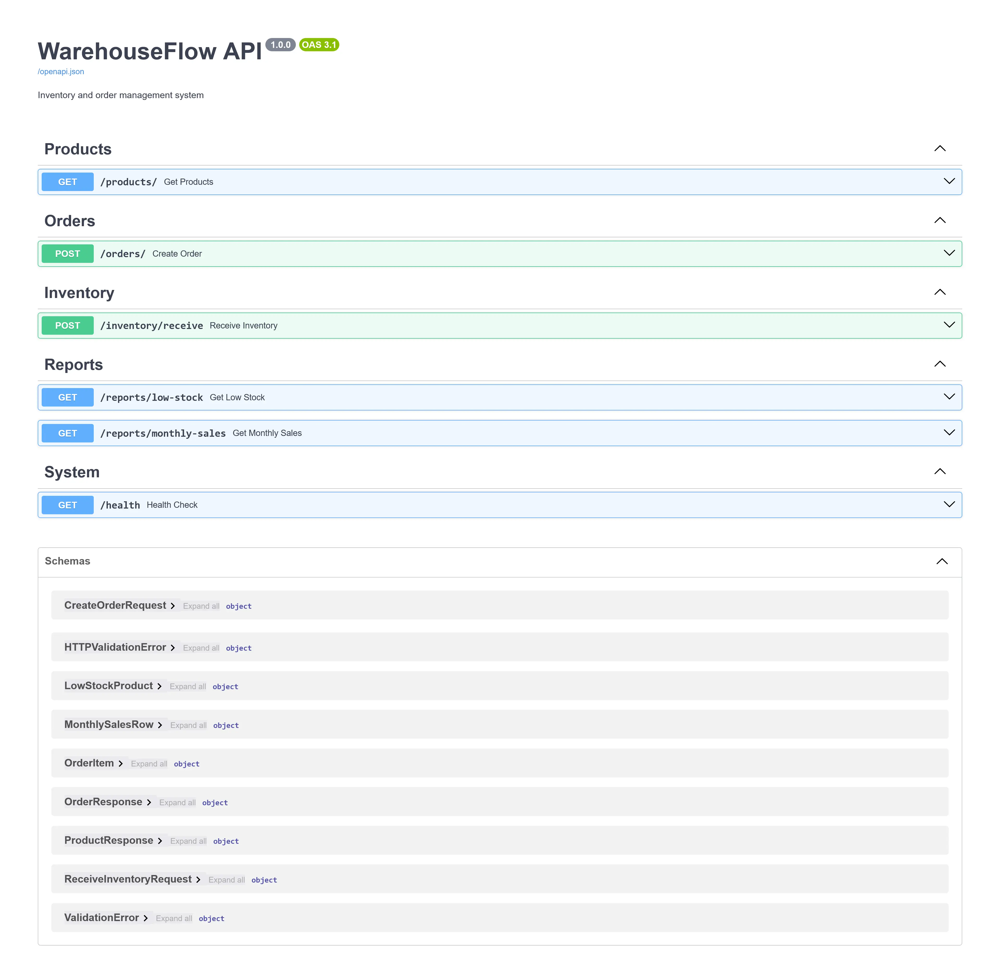
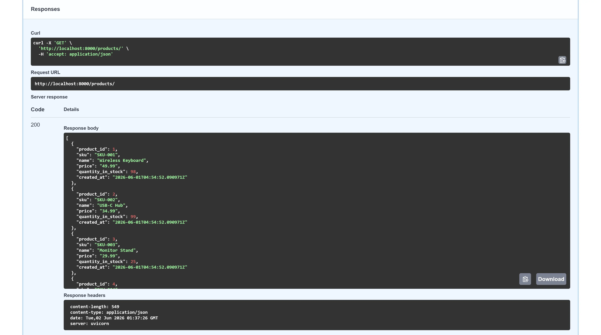
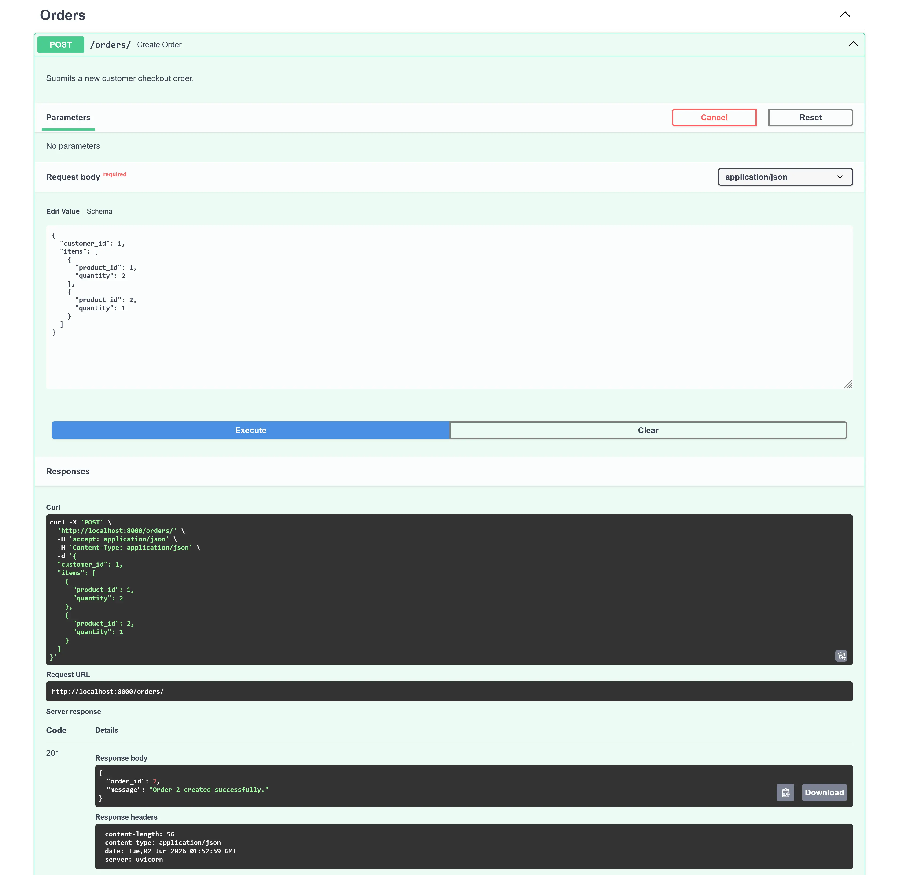
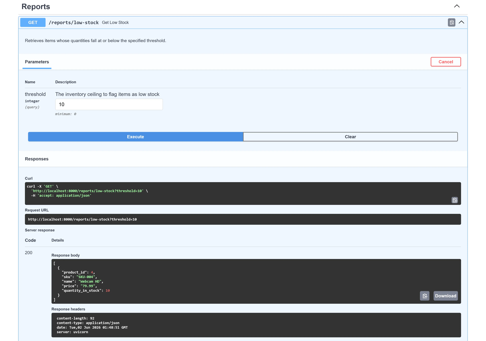
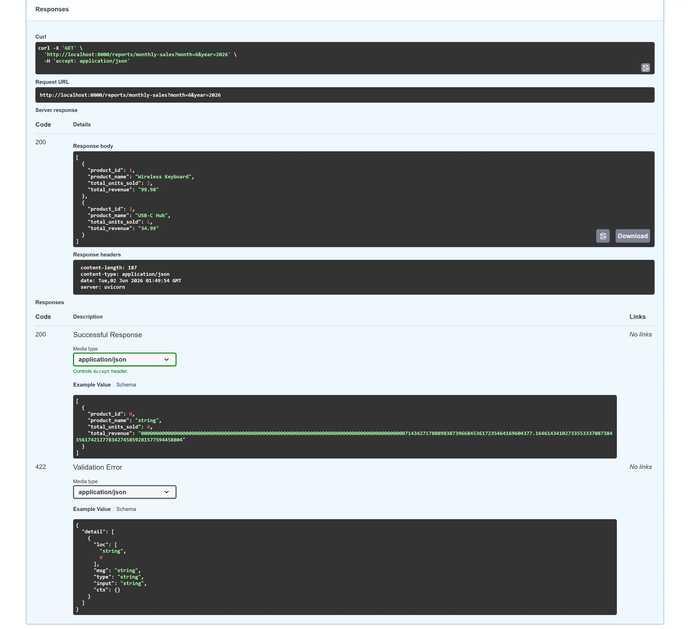

# WarehouseFlow

WarehouseFlow is a Dockerized inventory and order management backend built with PostgreSQL and FastAPI.

The project demonstrates production-oriented backend engineering concepts including transactional order processing, row-level locking, audit logging, trigger automation, connection pooling, query optimization, and database-centric business logic.

The system intentionally places core business rules inside PostgreSQL using stored procedures, functions, and triggers, while the FastAPI layer focuses on validation, orchestration, and API delivery.

---

## Preview



<table>
  <tr>
    <td></td>
    <td></td>
  </tr>
  <tr>
    <td></td>
    <td></td>
  </tr>
</table>

---

## Architecture

```text
Client
  │
  ▼ HTTP
┌──────────────────────┐
│      FastAPI API     │
│                      │
│  Validation          │
│  Routing             │
│  Response Models     │
└──────────┬───────────┘
           │ asyncpg
           ▼
┌──────────────────────┐
│     PostgreSQL       │
│                      │
│  Stored Procedures   │
│  Functions           │
│  Triggers            │
│  Audit Logging       │
└──────────────────────┘
```

For a detailed system design walkthrough, see:

```text
docs/architecture.md
```

---

## Engineering Highlights

### Transactional Order Processing

Order creation is implemented as a PostgreSQL stored procedure that:

- Validates inventory availability
- Creates order headers and line items
- Updates inventory levels
- Commits atomically or rolls back completely

This ensures no partial orders can be created.

### Concurrency Protection

Inventory allocation uses:

```sql
SELECT ...
FOR UPDATE
```

Product rows are locked in ascending `product_id` order to:

- Prevent overselling
- Avoid race conditions
- Reduce deadlock risk during concurrent orders

### Automated Audit Logging

Database triggers automatically record:

- Inventory changes
- Product price changes

Audit entries are generated regardless of which application or client modifies the database.

### Derived Data Maintenance

Order totals are maintained automatically through trigger-based recalculation, ensuring consistency between order headers and line items.

### Query Performance

Reporting functions use explicit date ranges:

```sql
order_date >= start_date
AND order_date < end_date
```

instead of:

```sql
EXTRACT(MONTH FROM order_date)
```

allowing PostgreSQL to utilize index range scans efficiently.

---

## Features

### Database

- Normalized relational schema
- Foreign key constraints
- Check constraints
- Stored procedures
- SQL functions
- Trigger automation
- Audit logging
- Transaction management
- Row-level locking
- Indexed reporting queries

### API

- FastAPI REST endpoints
- Pydantic request validation
- Async PostgreSQL access via `asyncpg`
- Connection pooling
- OpenAPI / Swagger documentation
- Structured error handling

### Infrastructure

- Dockerized deployment
- PostgreSQL health checks
- Automated startup ordering
- Persistent database storage

---

## Tech Stack

| Component        | Technology     |
| ---------------- | -------------- |
| Backend API      | FastAPI        |
| Database         | PostgreSQL 16  |
| Database Driver  | asyncpg        |
| Validation       | Pydantic v2    |
| Containerization | Docker         |
| Orchestration    | Docker Compose |

---

## API Endpoints

| Method | Endpoint                 | Description                      |
| ------ | ------------------------ | -------------------------------- |
| GET    | `/products`              | List products                    |
| POST   | `/orders`                | Create an order                  |
| POST   | `/inventory/receive`     | Receive inventory                |
| GET    | `/reports/low-stock`     | Products below a stock threshold |
| GET    | `/reports/monthly-sales` | Monthly sales report             |
| GET    | `/health`                | Service health check             |

---

## Example Requests

### Create Order

```bash
curl -X POST http://localhost:8000/orders \
  -H "Content-Type: application/json" \
  -d '{
    "customer_id": 1,
    "items": [
      {
        "product_id": 1,
        "quantity": 2
      },
      {
        "product_id": 2,
        "quantity": 1
      }
    ]
  }'
```

### Receive Inventory

```bash
curl -X POST http://localhost:8000/inventory/receive \
  -H "Content-Type: application/json" \
  -d '{
    "product_id": 1,
    "quantity": 50,
    "reason": "Supplier Shipment"
  }'
```

### Low Stock Report

```bash
curl "http://localhost:8000/reports/low-stock?threshold=10"
```

---

## Running Locally

### Prerequisites

- Docker Desktop

### Start the Application

```bash
git clone https://github.com/hermanconnor/warehouseflow.git

cd warehouseflow

docker compose up --build
```

### Access the API

Swagger UI:

```text
http://localhost:8000/docs
```

Health Check:

```text
http://localhost:8000/health
```

---

## Project Structure

```text
warehouseflow/
│
├── api/
│   ├── Dockerfile
│   ├── main.py
│   ├── db.py
│   ├── models.py
│   └── routes/
│       ├── __init__.py
│       ├── products.py
│       ├── orders.py
│       ├── inventory.py
│       └── reports.py
│
├── database/
│   ├── init.sql
│   ├── schema.sql
│   ├── procedures.sql
│   ├── triggers.sql
│   └── seed.sql
│
├── docs/
│   └── architecture.md
│
├── .dockerignore
├── docker-compose.yml
├── requirements.txt
├── .env
├── .gitignore
└── README.md

```

---

## Performance Notes

The reporting layer was designed with index utilization in mind.

For example, monthly sales reporting uses explicit date boundaries instead of `EXTRACT()` predicates, allowing PostgreSQL to perform efficient range scans on indexed timestamp columns.

Query plans can be inspected with:

```sql
EXPLAIN ANALYZE
SELECT *
FROM get_monthly_sales(1, 2026);
```

---

## Roadmap

Potential future enhancements:

- Authentication and authorization
- Role-based access control
- Multi-warehouse inventory support
- Shipment tracking
- CSV import/export workflows
- Frontend dashboard
- Cloud deployment

---

## License

MIT License
